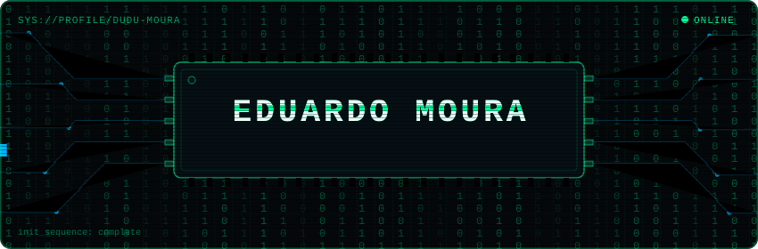
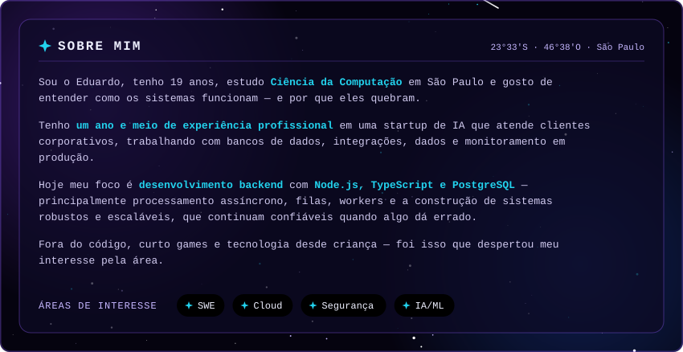
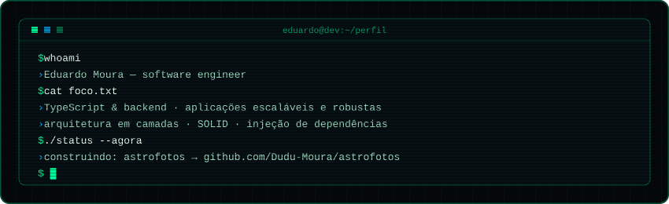
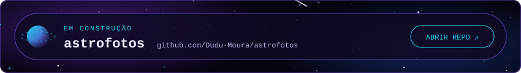
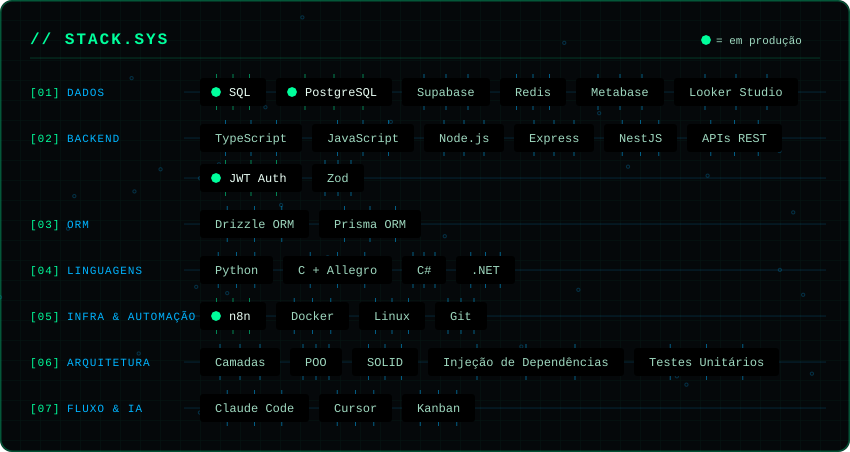
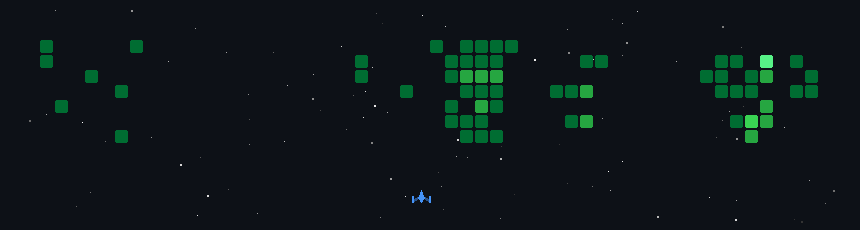
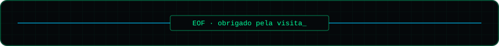

<!-- README de perfil — tema cósmico
  Coloque este README.md + assets/ (+ .github/) no repositório Dudu-Moura/Dudu-Moura. -->

<!-- SUA IMAGEM INICIAL: troque assets/banner.svg pelo seu banner/gif -->

