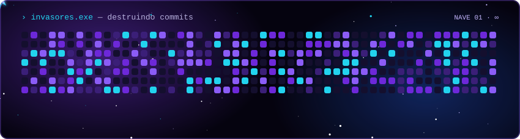

<!-- ============================================================
  README de perfil — tema cyberpunk
  Como usar: crie o repositório SEU_USUARIO/SEU_USUARIO, copie
  este README.md + a pasta assets/ (+ .github/ se quiser o snake real).
  Edite "SEU NOME" e os textos dentro de assets/header.svg e assets/about.svg.
============================================================= -->

<!-- 🖼️ SUA IMAGEM INICIAL: troque o arquivo abaixo pelo seu banner/gif -->

<!-- Quer o jogo usando SUAS contribuições reais? Ative .github/workflows/snake.yml
     e troque a linha acima por:

-->

